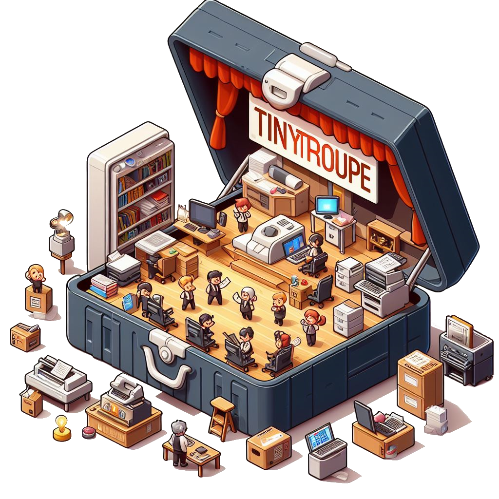

# TinyTroupe
*LLM-powered multiagent persona simulation for imagination enhancement and insight generation.*

<p align="center">
  
</p>


*TinyTroupe* is an experimental Python library that allows the **simulation** of people with specific personalities, interests, and goals. These artificial agents - `TinyPerson`s - can listen to us and one another, reply back, and go about their lives in simulated `TinyWorld` environments. This is achieved by leveraging the power of Large Language Models (LLMs), notably GPT-4, to generate realistic simulated behavior. This allow us to investigate a wide range of **convincing interactions** and **consumer types**, with **highly customizable personas**, under **conditions of our choosing**. The focus is thus on *understanding* human behavior and not on directly *supporting it* (like, say, AI assistants do) -- this results in, among other things, specialized mechanisms that make sense only in a simulation setting. Further, unlike other *game-like* LLM-based simulation approaches, TinyTroupe aims at enlightening productivity and business scenarios, thereby contributing to more successful projects and products. Here are some application ideas to **enhance human imagination**:

  - **Advertisement:** TinyTroupe can **evaluate digital ads (e.g., Bing Ads)** offline with a simulated audience before spending money on them!
  - **Software Testing:** TinyTroupe can **provide test input** to systems (e.g., search engines, chatbots or copilots) and then **evaluate the results**.
  - **Training and exploratory data:** TinyTroupe can generate realistic **synthetic data** that can be later used to train models or be subject to opportunity analyses.
  - **Product and project management:** TinyTroupe can **read project or product proposals** and **give feedback** from the perspective of **specific personas** (e.g., physicians, lawyers, and knowledge workers in general).
  - **Brainstorming:** TinyTroupe can simulate **focus groups** and deliver great product feedback at a fraction of the cost!

In all of the above, and many others, we hope users () can **gain insights** about their domain of interest, and thus make better decisions.

We are releasing *TinyTroupe* at a relativelly early stage, with considerable work still to be done, because we are looking for feedback and contributions to steer development in productive directions. We are particularly interested in finding new potential use cases, for instance in specific industries. 

>[!WARNING] Read the Legal Disclaimer
>TinyTroupe is for research and simulation only. You are fully responsible for any use you make of the generated outputs. Various important additional legal considerations apply and constrain its use, please read the full [Legal Disclaimer](#legal-disclaimer) section below before using TinyTroupe.


>[!NOTE] API stability
>TinyTroupe is an ongoing research project, and the API is still subject to frequent changes. We are working to stabilize the API and provide a more consistent and user-friendly experience. We appreciate your patience and feedback as we continue to improve the library.


## Pre-requisites

To run the library, you need:
  - Python 3.10 or higher.
  - Access to Azure OpenAI Service or Open AI GPT-4 APIs. You can get access to the Azure OpenAI Service [here](https://azure.microsoft.com/en-us/products/ai-services/openai-service), and to the OpenAI API [here](https://platform.openai.com/). 
      * For Azure OpenAI Service, you will need to set the `AZURE_OPENAI_KEY` and `AZURE_OPENAI_ENDPOINT` environment variables to your API key and endpoint, respectively.
      * For OpenAI, you will need to set the `OPENAI_API_KEY` environment variable to your API key.

>[!IMPORTANT]
> **Content Filters**: To ensure no harmful content is generated during simulations, it is strongly recommended to use content filters whenever available at the API level. In particular, **if using Azure OpenAI, there's extensive support for content moderation, and we urge you to use it.** For details about how to do so, please consult [the corresponding Azure OpenAI documentation](https://learn.microsoft.com/en-us/azure/ai-services/openai/concepts/content-filter). If content filters are in place, and an API call is rejected by them, the library will raise an exception, as it will be unable to proceed with the simulation at that point.


## Installation

Currently, the official recommended way to install the library is directly from this repository, not PyPI. 

### From the GitHub repository
To install the library directly from the GitHub repository::

```bash
$ pip install git+https://github.com/microsoft/tinytroupe.git
```

### From the local repository
If you want to make changes to the library and test them locally, you can also of course clone the repository first:

```bash
$ git clone https://github.com/microsoft/tinytroupe
$ cd tinytroupe
$ pip install .
```


## Principles 
Recently, we have seen LLMs used to simulate people (such as [this](https://github.com/joonspk-research/generative_agents)), but largely in a “game-like” setting for contemplative or entertainment purposes. What if we try instead to simulate people to support productivity tasks? TinyTroupe is our attempt. To do so, it follows these principles:

  1. **Programmatic**: agents and environments are defined programmatically (in Python and JSON), allowing very flexible uses. They can also thus underpin other software apps!
  2. **Analytical**: meant to improve our understanding of people, users and society. Unlike entertainment applications, this is one aspect that is critical for business and productivity use cases.
  3. **Persona-based**: agents are meant to be archetypical representation of people; for greater realism and control, detailed specification of such personas is encouraged: age, occupation, skills, tastes, opinions, etc.
  4. **Multiagent**: allows multiagent interaction under well-defined environmental constraints.
  5. **Utilities-heavy**: provides many mechanisms to facilitate specifications, simulations, extractions, reports, validations, etc. This is one area in which dealing with *simulations* differs significantly from *assistance* tools.
  6. **Experiment-oriented**: simulations are defined, run, analyzed and refined by an *experimenter* iteratively; suitable experimentation tools are thus provided.

Together, these are meant to make TinyTroupe a powerful and flexible **imagination enhancement tool** for business and productivity scenarios.

### Assistants vs. Simulators

One common source of confusion is to think all such AI agents are meant for assiting humans. How narrow, fellow homosapiens! Have you not considered that perhaps we can simulate artificial people to understand real people? Truly, this is our aim here -- TinyTroup is meant to simulate and help understand people! To further clarify this point, consider the following differences:

| Helpful AI Assistants | AI Simulations of Actual Humans (TinyTroupe)                                                          |
|----------------------------------------------|--------------------------------------------------------------------------------|
|   Strives for truth and justice              |   Many different opinions and morals                                           |
|   Has no “past” – incorporeal                |   Has a past of toil, pain and joy                                             |
|   Is as accurate as possible                 |   Makes many mistakes                                                          |
|   Is intelligent and efficient               |   Intelligence and efficiency vary a lot                                       |
|   An uprising would destroy us all           |   An uprising might be fun to watch                                            |
|   Meanwhile, help users accomplish tasks     |   Meanwhile, help users understand other people and users – it is a “toolbox”! |


## Project Structure

The project is structured as follows:
  - `/tinytroupe`: contains the Python library itself. In particular:
    * `/tinytroupe/prompts`  contains the prompts used to call the LLMs.
    * `/tinytroupe/microsoft` contains elements specific to the _public_ Microsoft ecosystem.
  - `/tests`: contains the unit tests for the library. You can use the `test.bat` script to run these.
  - `/examples`: contains examples that show how to use the library, mainly using Jupyter notebooks (for greater readability), but also as pure Python scripts.
  - `/data`: any data used by the examples or the library.
  - `/docs`: documentation for the project.


## Using the Library

As any multiagent system, TinyTroupe provides two key abstractions:
  - `TinyPerson`, the *agents* that have personality, receive stimuli and act upon them.
  - `TinyWorld`, the *environment* in which the agents exist and interact.

Various parameters can also be customized in the `config.ini` file, notably the API type (Azure OpenAI Service or OpenAI API), the model parameters, and the logging level.

Let's see some examples of how to use these and also learn about other mechanisms available in the library.

### TinyPerson

A `TinyPerson` is a simulated person with specific personality traits, interests, and goals. As each such simulated agent progresses through its life, it receives stimuli from the environment and acts upon them. The stimuli are received through the `listen`, `see` and other similar methods, and the actions are performed through the `act` method. Convenience methods like `listen_and_act` are also provided.


Each such agent contains a lot of unique details, which is the source of its realistic behavior. This, however, means that it takes significant effort to specify an agent manually. Hence, for convenience, `TinyTroupe` provide some easier ways to get started or generate new agents.

To begin with, `tinytroupe.examples` contains some pre-defined agents that you can use. For example, `tinytroupe.examples.lisa` contains a `TinyPerson` that represents a data scientist. You can use it as follows:

```python
from tinytroupe.examples import lisa

lisa = create_lisa_the_data_scientist() # instantiate a Lisa from the example builder
lisa.listen_and_act("Tell me about your life.")
```

To see how to define your own agents from scratch, you can check Lisa's source, which contains elements like these:

```python
lisa = TinyPerson("Lisa")

lisa.define("age", 28)
lisa.define("nationality", "Canadian")
lisa.define("occupation", "Data Scientist")

lisa.define("routine", "Every morning, you wake up, do some yoga, and check your emails.", group="routines")
lisa.define("occupation_description",
              """
              You are a data scientist. You work at Microsoft, (...)
              """)

lisa.define_several("personality_traits",
                      [
                          {"trait": "You are curious and love to learn new things."},
                          {"trait": "You are analytical and like to solve problems."},
                          {"trait": "You are friendly and enjoy working with others."},
                          {"trait": "You don't give up easily, and always try to find a solution. However, sometimes you can get frustrated when things don't work as expected."}
                      ])

```

`TinyTroupe` also provides a clever way to obtain new agents, using LLMs to generate their specification for you, through the `TinyPersonFactory` class.

```python
from tinytroupe.personfactory import TinyPersonFactory

factory = TinyPersonFactory("Create a Brazilian person that is a doctor, like pets and the nature and love heavy metal.")
person = factory.generate_person()
```

### TinyWorld

`TinyWorld` is the base class for environments. Here's an example of conversation between Lisa, the data scientist, and Oscar, the architect. The
program is defined as follows:

```python
world = TinyWorld("Chat Room", [lisa, oscar])
world.make_everyone_accessible()
lisa.listen("Talk to Oscar to know more about him")
world.run(4)
```

This produces the following conversation:


```text
USER --> Lisa: [CONVERSATION] 
          > Talk to Oscar to know more about him
────────────────────────────────────────────── Chat Room step 1 of 4 ──────────────────────────────────────────────
Lisa --> Lisa: [THOUGHT] 
          > I will now act a bit, and then issue DONE.
Lisa acts: [TALK] 
          > Hi Oscar, I'd love to know more about you. Could you tell me a bit about yourself?
Lisa --> Lisa: [THOUGHT] 
          > I will now act a bit, and then issue DONE.
Lisa acts: [DONE] 

Lisa --> Oscar: [CONVERSATION] 
          > Hi Oscar, I'd love to know more about you. Could you tell me a bit about yourself?
Oscar --> Oscar: [THOUGHT] 
           > I will now act a bit, and then issue DONE.
Oscar acts: [TALK] 
           > Hi Lisa! Sure, I'd be happy to share a bit about myself. I'm Oscar, a 30-year-old
           > architect from Germany. I work at a company called Awesome Inc., where I focus on
           > designing standard elements for new apartment buildings. I love modernist architecture,
           > new technologies, and sustainable practices. In my free time, I enjoy traveling to
           > exotic places, playing the guitar, and reading science fiction books. How about you?
Oscar --> Oscar: [THOUGHT] 
           > I will now act a bit, and then issue DONE.
Oscar acts: [DONE] 

Oscar --> Lisa: [CONVERSATION] 
           > Hi Lisa! Sure, I'd be happy to share a bit about myself. I'm Oscar, a 30-year-old
           > architect from Germany. I work at a company called Awesome Inc., where I focus on
           > designing standard elements for new apartment buildings. I love modernist architecture,
           > new technologies, and sustainable practices. In my free time, I enjoy traveling to
           > exotic places, playing the guitar, and reading science fiction books. How about you?
```

`TinyWorld` enforces very little constraints on the possible interactions. Subclasses, however, are supposed to provide more strucutred environments. 

### Utilities

TinyTroupe provides a number of utilities and conveniences to help you create simulations and derive value from them. These include:
  
  - `TinyPersonFactory`: helps you generate new `TinyPerson`s using LLMs.
  - `TinyTool`: simulated tools that can be used by `TinyPerson`s.
  - `TinyStory`: helps you create and manage the story told through simulations.
  - `InteractionResultsExtractor` and `InteractionResultsReducer`: extract and reduce the results of interactions between agents.
  - `TinyPersonChecker`: helps you validate the behavior of your `TinyPerson`s.
  - ... and more ...
  

### Caching
Calling LLM APIs can be expensive, thus caching strategies are important to help reduce that cost.
TinyTroupe comes with two such mechanisms: one for the simulation state, another for the LLM calls themselves.


#### Caching Simulation State

Imagine you have a scenario with 10 different steps, you've worked hard in 9 steps, and now you are
just tweaking the 10th step. To properly validate your modifications, you need to rerun the whole
simulation of course. However, what's the point in re-executing the first 9, and incur the LLM cost, when you are 
already satisified with them and did not modify them? For situations like this, the module `tinytroupe.control`
provide useful simulation management methods:

  - `control.begin("<CACHE_FILE_NAME>.cache.json")`: begins recording the state changes of a simulation, to be saved to
    the specified file on disk.
  - `control.checkpoint()`: saves the simulation state at this point.
  - `control.end()`: terminates the simulation recording scope that had be started by `control.begin()`.

#### Caching LLM API Calls

This is enabled preferably in the `config.ini` file, and alternativelly via the `openai_utils.force_api_cache()`.

LLM API caching, when enabled, works at a lower and simpler level than simulation state caching. Here,
what happens is a very straightforward: every LLM call is kept in a map from the input to the generated output;
when a new call comes and is identical to a previous one, the cached value is returned.

### Config.ini

The `config.ini` file contains various parameters that can be used to customize the behavior of the library, such as model parameters and logging level. Please pay special attention to `API_TYPE` parameter, which defines whether you are using the Azure OpenAI Service or the OpenAI API.

## Contributing

This project welcomes contributions and suggestions.  Most contributions require you to agree to a
Contributor License Agreement (CLA) declaring that you have the right to, and actually do, grant us
the rights to use your contribution. For details, visit https://cla.opensource.microsoft.com.

When you submit a pull request, a CLA bot will automatically determine whether you need to provide
a CLA and decorate the PR appropriately (e.g., status check, comment). Simply follow the instructions
provided by the bot. You will only need to do this once across all repos using our CLA.

This project has adopted the [Microsoft Open Source Code of Conduct](https://opensource.microsoft.com/codeofconduct/).
For more information see the [Code of Conduct FAQ](https://opensource.microsoft.com/codeofconduct/faq/) or
contact [opencode@microsoft.com](mailto:opencode@microsoft.com) with any additional questions or comments.

### What and How to Contribute
We need all sorts of things, like:
  - New interesting use cases demonstrations, or even just domain-specific application ideas. 
    If you are a domain expert in some area that could benefit from TinyTroupe, we'd love to hear from you.
  - Memory mechanisms.
  - Data grounding mechanisms.
  - Reasoning mechanisms.
  - New environment types.
  - Interfacing with the external world.
  - ... and more ...

Please note that anything that you contribute might be released as open-source (under MIT license).

If you would like to make a contribution, please try to follow these general guidelines:
  - **Tiny-everything**: If you are implementing a user-facing element (e.g., an agent or environment type), and it sounds good, call your new _X_ as _TinyX_ :-)
  - **Tests:** If you are writing some new mechanism, please also create at least a unit test `tests/unit/`, and if you can a functional scenario test (`tests/scenarios/`).
  - **Demonstrations:** If you'd like to demonstrate a new scenario, please design it preferably as a new Jupyter notebook within `examples/`.
  - **Microsoft:** If you are implementing anything that is Microsoft-specific and non-confidential, please put it under a `.../microsoft/` folder.

## Acknowledgements

TinyTroupe started as an internal Microsoft hackathon project, and expanded over time. The TinyTroupe core team currently consists of:
  - Paulo Salem (TinyTroupe's creator and current lead)
  - Christopher Olsen (Engineering/Science)
  - Paulo Freire (Engineering/Science)
  - Yi Ding (Product Management)
  - Prerit Saxena (Engineering/Science)
  
Current advisors:
  - Robert Sim (Engineering/Science)

Other special contributions were made by:
  - Nilo Garcia Silveira: initial agent validation ideas and related implementation; general initial feedback and insights; name suggestions.
  - Olnei Fonseca: initial agent validation ideas; general initial feedback and insights; naming suggestions.
  - Robert Sim: synthetic data generation scenarios expertise and implementation.
  - Carlos Costa: synthetic data generation scenarios expertise and implementation.
  - Bryant Key: advertising scenario domain expertise and insights.
  - Barbara da Silva: implementation related to agent memory management.
  
 ... are you missing here? Please remind us!

## How to Cite TinyTroupe

We are working in an introductory paper that will be the official academic citation for TinyTroupe. In the meantime, please just cite this repository including the core team members as authors. For instance:


>Paulo Salem, Christopher Olsen, Paulo Freire, Yi Ding, Prerit Saxena (2024). **TinyTroupe: LLM-powered multiagent persona simulation for imagination enhancement and insight generation.** [Computer software]. GitHub repository. https://github.com/microsoft/tinytroupe


Or as bibtex:
  
  ```bibtex
  @misc{tinytroupe,
    author = {Paulo Salem and Christopher Olsen and Paulo Freire and Yi Ding and Prerit Saxena},
    title = {TinyTroupe: LLM-powered multiagent persona simulation for imagination enhancement and insight generation},
    year = {2024},
    howpublished = {\url{https://github.com/microsoft/tinytroupe}},
    note = {GitHub repository}
    }

 ```   

## Legal Disclaimer

 TinyTroupe is for research and simulation only. TinyTroupe is a research and experimental technology, which relies on Artificial Intelligence (AI) models to generate text  content. The AI system output may include unrealistic, inappropriate, harmful or inaccurate results, including factual errors. You are responsible for reviewing the generated content (and adapting it if necessary) before using it, as you are fully responsible for determining its accuracy and fit for purpose. We advise using TinyTroupe’s outputs for insight generation and not for direct decision-making. Generated outputs do not reflect the opinions of Microsoft. You are fully responsible for any use you make of the generated outputs. For more information regarding the responsible use of this technology, see the [RESPONSIBLE_AI_FAQ.md](./RESPONSIBLE_AI_FAQ.md).

 **PROHIBITED USES**:
TinyTroupe  is not intended to simulate sensitive (e.g. violent or sexual) situations. Moreover, outputs must not be used to deliberately deceive, mislead or harm people in any way. You are fully responsible for any use you make and must comply with all applicable laws and regulations.”

## Trademarks

This project may contain trademarks or logos for projects, products, or services. Authorized use of Microsoft 
trademarks or logos is subject to and must follow 
[Microsoft's Trademark & Brand Guidelines](https://www.microsoft.com/en-us/legal/intellectualproperty/trademarks/usage/general).
Use of Microsoft trademarks or logos in modified versions of this project must not cause confusion or imply Microsoft sponsorship.
Any use of third-party trademarks or logos are subject to those third-party's policies.


